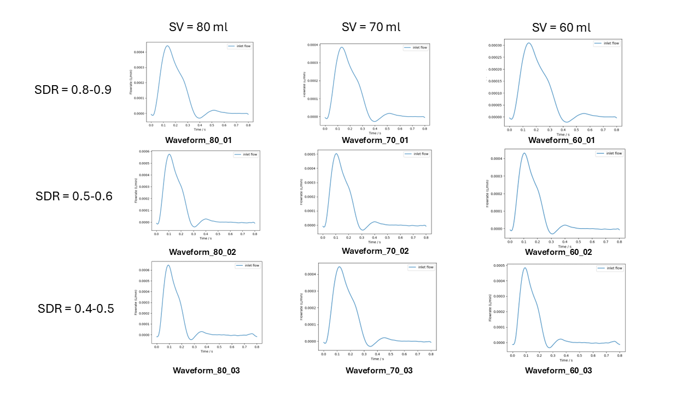
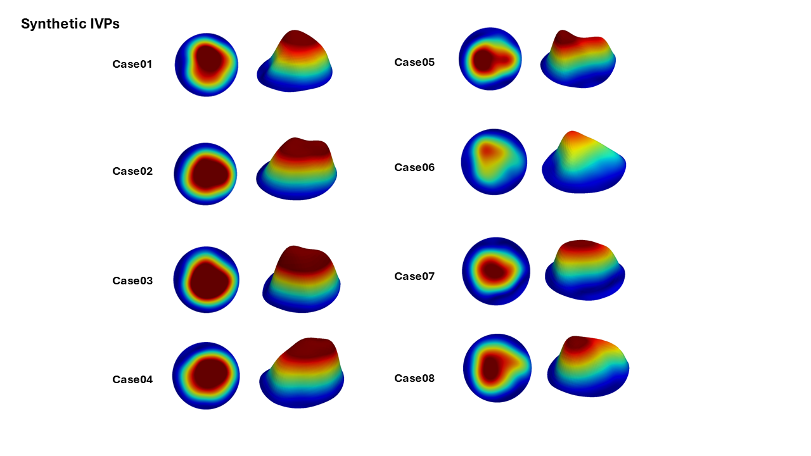

# Important Update!
In the paper, the Pearson Correlation plot for Flat (Figure 8) is uploaded with a mistake. The correct figure is shown below. 

# Personalizing-3DIVP-TBAD
This code is used to personalize synthetic 3D IVPs for computational studies in TBAD.  
Workflow for applying synthetic IVPs:

## Select a waveform  
Select an appraporiate inlet flow waveform based on stoke volume (SV) and systole-to-disatole ratio (SDR). 

## Select a syntheic profile
8 different synthetic profiles are provided in this repo. Pick 1 for mapping.

## 3EWM tuning
The mean flowrate from Profile_scaling.py is outputted for 3EWM tuning.

## Reach out for more specific inlet waveforms and synthetic profiles. 
email: k.wang21@imperial.ac.uk

## Please cite the following publications
1. Wang, K., Armour, C.H., Guo, B., Dong, Z. and Xu, X.Y., 2024. A new method for scaling inlet flow waveform in hemodynamic analysis of aortic dissection. International Journal for Numerical Methods in Biomedical Engineering, 40(9), p.e3855.  
2. Wang, K., Armour, C.H., Hanna, L., Gibbs, R. and Xu, X.Y., 2025. Generation of personalized synthetic 3-dimensional inlet velocity profiles for computational fluid dynamics simulations of type B aortic dissection. Computers in Biology and Medicine, 191, p.110158.
